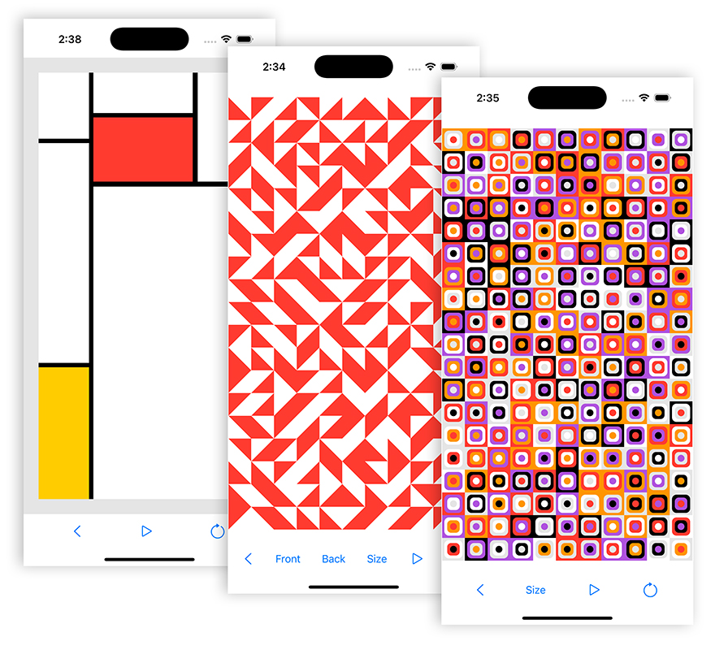

# GenerativeArt

**GenerativeArt** contains examples of generative art. Most consist of grids with random lines or shapes. Also included is a random generator of images inspired by the paintings of Piet Mondrian.

## Getting Started
To run the app you need to add a `User.xconfig` file in the `Resources` folder. Include your settings for `PRODUCT_BUNDLE_IDENTIFIER` and `DEVELOPMENT_TEAM`.
